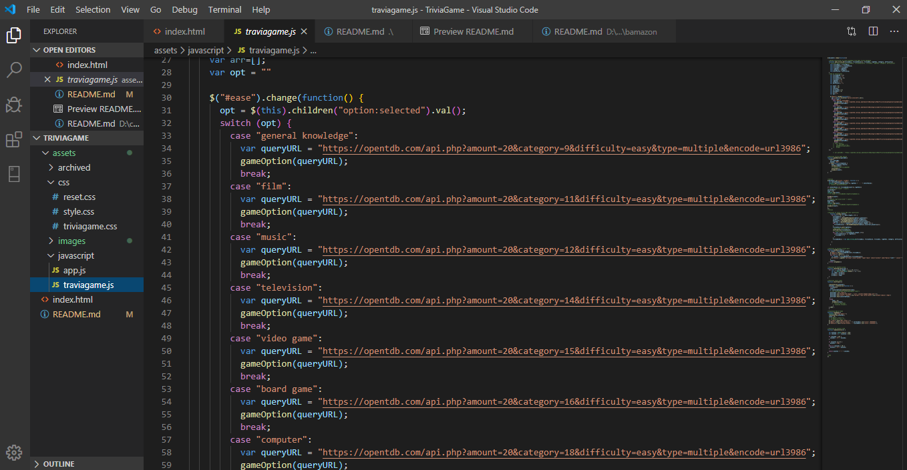

# TriviaGame

## Overview
Original of this game was done with  coding trivia question manually. I have remake this app with open trivia API so it can refresh game without repeat questions. Also, redesign web layout to make it visual friendly.

## Technology
* Ajax to retrieve trivia data from open trivia API, https://opentdb.com/api_config.php
* Constructor to store trivia question into object
* Count down timer to add challenge
* Dropdown manu to play different categories
* switch case to  play different categories

## image of technology

